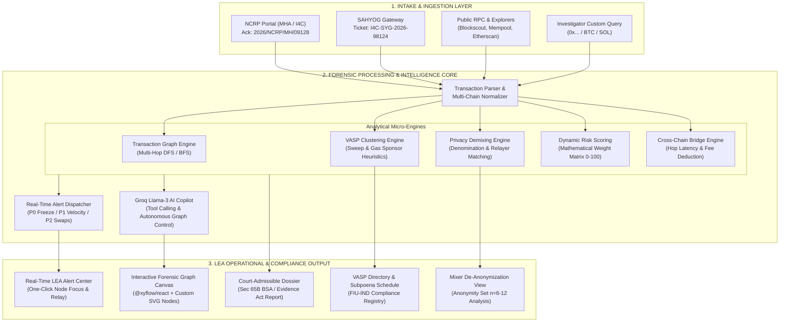
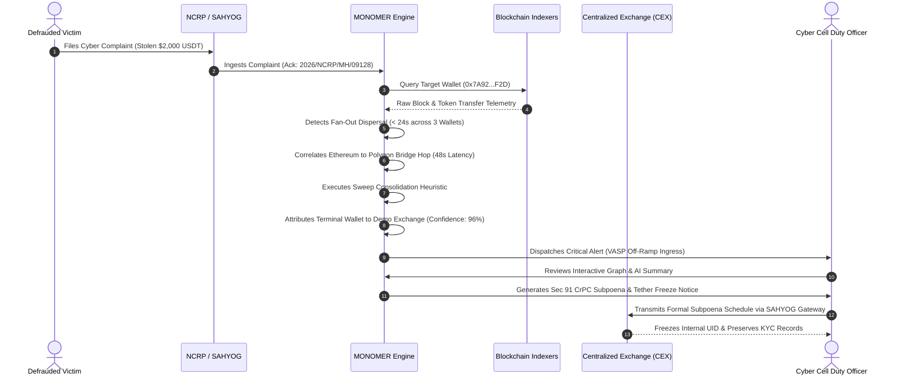

# MONOMER: Real-Time Cryptocurrency Fraud Attribution & VASP Identification Platform

[](https://sih.gov.in)
[](https://nextjs.org/)
[](https://www.typescriptlang.org/)
[](https://reactflow.dev/)
[](https://mha.gov.in)
[](https://opensource.org/licenses/MIT)

> **Autonomous Blockchain Intelligence, Multi-Hop Laundering Pattern Recognition, Nearest VASP Off-Ramp Attribution, and Court-Admissible Forensic Evidence Generation for Law Enforcement Agencies (LEAs).**

---

## 📑 Table of Contents

- [Executive Summary](#-executive-summary)
- [System Architecture](#-system-architecture)
- [Investigation Lifecycle & Flow](#-investigation-lifecycle--flow)
- [Key Features & Capabilities](#-key-features--capabilities)
  - [1. NCRP & SAHYOG Ingestion Gateway](#1-ncrp--sahyog-ingestion-gateway)
  - [2. Multi-Chain Real-Time Blockchain Indexer](#2-multi-chain-real-time-blockchain-indexer)
  - [3. Exchange Clustering & VASP Attribution](#3-exchange-clustering--vasp-attribution)
  - [4. Mixers & Privacy Protocol De-Anonymization](#4-mixers--privacy-protocol-de-anonymization)
  - [5. Interactive Forensic Transaction Graph](#5-interactive-forensic-transaction-graph)
  - [6. AI/ML-Assisted Investigation Agent](#6-aiml-assisted-investigation-agent)
  - [7. Real-Time LEA Alert Center](#7-real-time-lea-alert-center)
  - [8. Court-Admissible Forensic Dossier & Reports](#8-court-admissible-forensic-dossier--reports)
- [Demonstration Case: Operation Broken Fan](#-demonstration-case-operation-broken-fan)
- [Tech Stack](#-tech-stack)
- [Getting Started & Local Setup](#-getting-started--local-setup)
- [API Reference](#-api-reference)
- [Legal & Regulatory Compliance](#-legal--regulatory-compliance)
- [License](#-license)

---

## 🛡️ Executive Summary

Cyber fraud victims increasingly report suspect cryptocurrency wallet addresses used by fraudsters in **investment scams, task-based Telegram frauds, digital arrest/sextortion schemes, ransomware, and phishing**. 

In active investigations, reported wallet addresses are rarely custodial accounts; they are typically **non-custodial wallets, single-use burner addresses, or intermediate layering hops**. Traditional manual blockchain tracing requires deep domain expertise and hours of effort, particularly when illicit funds traverse:
* **Multi-chain liquidity bridges** (Ethereum &rarr; Polygon, Arbitrum, BSC),
* **High-velocity automated dispersal scripts** (< 24s execution cadence),
* **Zero-knowledge mixers / tumblers** (Tornado Cash, Railgun), and
* **Complex layering hops across synthetic burner clusters**.

**MONOMER** bridges the critical latency gap between victim complaint registration and financial asset preservation. It ingests complaints directly from the **National Cybercrime Reporting Portal (NCRP)** and the **I4C SAHYOG Platform**, automatically traces fund dispersion across chains, isolates the nearest regulated **Virtual Asset Service Provider (VASP) / Centralized Exchange (CEX)** receiving direct deposits, and auto-generates statutory asset freeze notices under **Section 91 CrPC / Section 94 Bharatiya Nagarik Suraksha Sanhita (BNSS 2023)**.

---

## 🏛️ System Architecture

The following diagram illustrates the end-to-end processing pipeline of MONOMER:



---

## 🔄 Investigation Lifecycle & Flow



---

## 🚀 Key Features & Capabilities

### 1. NCRP & SAHYOG Ingestion Gateway
* **Direct Portal Integration**: Ingests complaints registered under the National Cybercrime Reporting Portal (`cybercrime.gov.in`) with automated case instantiation.
* **Pre-Packaged Case Archetypes**:
  * *NCRP/MH/09128*: Phishing Contract / High-Yield Bot Fraud ($2,000 USDT).
  * *NCRP/KA/44812*: Telegram Task-Based Job Fraud & Fake Liquidity Pool ($4,500 USDT).
  * *NCRP/DL/77201*: Digital Arrest & Crypto Demand Extortion (3,100 USDT).
* **Metadata Tracking**: Persists NCRP Acknowledgement Numbers, I4C SAHYOG Ticket IDs, Complainant Identity, Police Station Jurisdiction, and FIR/GD statutory references across all investigative reports.

### 2. Multi-Chain Real-Time Blockchain Indexer
* **Live Explorer & RPC Support**: Integrates open block explorer REST APIs (Blockscout, Mempool.space, Etherscan API endpoints) across **Ethereum Mainnet, Polygon POS, Arbitrum One, and Bitcoin (UTXO)**.
* **On-Demand Address Tracing**: Accepts any valid 0x EVM or Bitcoin address, parses balances, extracts recent transactions and counterparty addresses, and renders an active on-chain graph in real time.
* **Resilient Fallback**: Automatically degrades to high-fidelity simulated telemetry if live RPC endpoints hit rate limits or lack external connectivity.

### 3. Exchange Clustering & VASP Attribution
* **Nearest Exchange Identification**: Pinpoints the terminal centralized exchange (CEX) deposit hotwallet where illicit funds settle for fiat off-ramping.
* **Clustering Heuristics**:
  * *Sweep Consolidation Heuristic*: Attributes one-time forwarder wallets that sweep 90%+ of balances to omnibus hotwallet pools within brief temporal windows.
  * *Common Gas Sponsor Heuristic*: Identifies clusters funded by identical parent deployer or operational wallets.
  * *Nonce Cadence & Timing Correlation*: Flags synchronized programmatic disbursements.
* **FIU-IND Compliance Directory**: Maintained registry of Indian and Global Virtual Asset Service Providers (CoinDCX, WazirX, CoinSwitch, Binance, Demo Exchange) with regulatory status, emergency nodal emails, and subpoena portals.

### 4. Mixers & Privacy Protocol De-Anonymization
* **Monitored Protocols**: Tracks transactions interacting with **Tornado Cash** (0.1, 1, 10, 100 USDT/ETH pools), **Railgun** zk-SNARK contracts, and instant non-custodial swappers (**ChangeNOW**).
* **De-Anonymization Heuristics**:
  * *Equal-Denomination Fingerprinting*: Matches deposit amounts minus protocol gas fees to withdrawals.
  * *Anonymity Set Dilution Analysis*: Computes pool size $n$; low pool dilution ($n \le 12$) achieves linkability confidence exceeding 80%.
  * *Relayer Footprint Unmasking*: Correlates gas sponsors of withdrawal relayers to identify common operational nodes.

### 5. Interactive Forensic Transaction Graph
* **Interactive Canvas**: Built with `@xyflow/react` featuring custom forensic SVG nodes (Victim, Primary Suspect, Layering Intermediary, Bridge Contract, Polygon Destination, and Centralized Exchange).
* **Forensic Flow Edges**: Color-coded directional edges displaying transferred values, assets, block numbers, transaction hashes, and pattern tags.
* **Investigative Tooling**: Time scrubber (stepping through transactions chronologically), layout switcher, chain filters, and camera focus controls.

### 6. AI/ML-Assisted Investigation Agent
* **Autonomous Reasoning**: Powered by Groq Llama-3 with function calling / tool use.
* **Built-in Tools**:
  * `get_investigation_summary()`: Case overview and total volume metrics.
  * `get_wallet(walletId)`: Deep profile, tags, balance, and risk score.
  * `get_cross_chain_events()`: Bridge hop latency, fee deduction, and release hashes.
  * `get_risk_assessment()`: Mathematical signal breakdown.
  * `focus_wallet(walletId)`: Dynamically steers the UI camera to isolate specific entities.
* **Plain English Q&A**: Non-technical officers can ask *"Where did the remaining funds go?"* or *"Which exchange holds the funds?"* and the AI responds with citations and highlights the graph.

### 7. Real-Time LEA Alert Center
* **Heuristic Alert Rules**:
  * 🔴 **CRITICAL FREEZE**: Direct deposit into regulated CEX hotwallet.
  * 🟠 **HIGH VELOCITY**: Rapid dispersal across $\ge 3$ intermediary addresses within $< 60$ seconds.
  * 🟠 **CROSS-CHAIN JUMP**: Bridge deposit and claim on secondary chain.
  * 🟡 **ANONYMIZATION DETECTED**: Mixer pool or relayer interaction.
  * 🔵 **SAHYOG AUTO-SYNC**: Automated generation of emergency preservation notice.
* **Interactive Drawer**: Pulsing notification bell in header with unread count, severity filters, one-click node focus, and **"Dispatch to SAHYOG"** relay button.

### 8. Court-Admissible Forensic Dossier & Reports
* **Section 65B BSA Compliance**: Formatted in strict compliance with Section 65B of the Indian Evidence Act / Bharatiya Sakshya Adhiniyam (BSA 2023).
* **Sealed Digital Evidence Table**: Every transaction, bridge hop, and cluster proof is assigned an Evidence ID (`EVD-001` to `EVD-006`) with verified SHA-256 cryptographic hashes and block heights.
* **VASP Subpoena Schedule**: Auto-generates statutory notices under **Section 91 CrPC / Section 94 BNSS** addressed to the exchange compliance team, requesting IP logs, KYC identities, internal UIDs, and immediate administrative asset freezing.

---

## 🔍 Demonstration Case: Operation Broken Fan

* **Case ID**: `INV-DEMO-2026-001`
* **NCRP Acknowledgement**: `2026/NCRP/MH/09128`
* **SAHYOG Ticket**: `I4C-SYG-2026-98124`
* **Jurisdiction**: Cyber Crime Police Station, BKC, Mumbai
* **Stolen Inflow**: $2,000.00 USDT (Phishing contract interaction)
* **Risk Score**: 78 / 100 (**HIGH RISK**)

### Reconstructed Flow Topology

```
[Victim: 0xVIC7...cf1]
       │
       ▼ (10:31:04 UTC • $2,000 USDT)
[Primary Suspect: 0x7A92...F2D] ─── High Velocity Fan-Out (< 24s)
       ├──> [Wallet B: 0x82BC...c41A] ── ($800 USDT) ──> ($760 onward)
       ├──> [Wallet D: 0x44AF...991B] ── ($500 USDT) ──> (Parking Node)
       └──> [Wallet C: 0x19DE...a7C2] ── ($700 USDT)
                   │
                   ▼ (10:35:02 UTC)
            [Demo Bridge Contract: 0xBR1D...77E]
                   │
                   ▼ (Bridge Hop: 48s latency • $2 fee)
            [Polygon Transit: 0x98EF...fB8]
                   │
                   ▼ (10:41:52 UTC • $680 USDT)
            [Centralized Exchange: 0xEXCH...401] ─── PRIMARY FREEZE TARGET
```

---

## 💻 Tech Stack

| Component | Technology | Description |
| :--- | :--- | :--- |
| **Framework** | Next.js 14 (App Router) | High-performance React framework with server/client boundaries |
| **Language** | TypeScript 5.8 | End-to-end type safety across schemas and forensic engines |
| **Styling** | Tailwind CSS 3.4 | Monochromatic, high-density forensic dark theme |
| **Graph Canvas** | `@xyflow/react` 12 | Hardware-accelerated transaction graph rendering |
| **Icons & UI** | Lucide React | Clean, standardized vector iconography |
| **Visual Charts** | Recharts 2.15 | Flow volume distribution and latency charts |
| **AI LLM Core** | Groq Cloud (Llama 3 70B / 8B) | Ultra-fast inference (< 400ms) with JSON tool calling |
| **Markdown** | React-Markdown + Remark-GFM | Streaming AI responses and formatted forensic dossiers |
| **Database** | Neon Serverless Postgres | SQL schema for persistent case indexing and evidence logs |

---

## 🛠️ Getting Started & Local Setup

### Prerequisites
* **Node.js**: v18.17.0 or higher
* **npm**: v9.0.0 or higher

### 1. Clone the Repository
```bash
git clone https://github.com/debuuuuuu/SIHcrypto26183.git
cd SIHcrypto26183
```

### 2. Install Dependencies
```bash
npm install
```

### 3. Configure Environment Variables
Copy the example environment file:
```bash
cp .env.example .env.local
```
Edit `.env.local` to provide your API keys (optional; the application runs out of the box with offline mock fallbacks):
```env
# Optional: Groq Cloud API Key for live AI Investigator inference
GROQ_API_KEY=your_groq_api_key_here

# Optional: Neon Serverless Postgres Connection String
DATABASE_URL=your_neon_database_url_here
```

### 4. Run the Development Server
```bash
npm run dev
```
Open your browser and navigate to:
* **Landing & Intake**: [`http://localhost:3000`](http://localhost:3000)
* **Direct Investigation Dashboard**: [`http://localhost:3000/dashboard`](http://localhost:3000/dashboard)

### 5. Production Build
```bash
npm run build
npm start
```

---

## 📡 API Reference

### 1. NCRP Complaint Ingestion
* **Endpoint**: `POST /api/ingest/ncrp`
* **Description**: Ingests a cybercrime complaint payload and initialises a tracing case.
* **Payload**:
```json
{
  "ackNumber": "2026/NCRP/MH/09128",
  "sahyogTicketId": "I4C-SYG-2026-98124",
  "complainantName": "Rajesh K. Sharma",
  "policeStationJurisdiction": "Cyber Crime Police Station, BKC, Mumbai",
  "targetAddress": "0x7A92d044e1837bF2D",
  "targetChain": "Ethereum",
  "lossAmountUSD": 2000,
  "crimeSubCategory": "Phishing Contract / Investment Scam"
}
```

### 2. Live Blockchain Address Trace
* **Endpoint**: `POST /api/blockchain/trace`
* **Description**: Queries live explorer and mempool APIs to trace transactions for any public address.
* **Payload**:
```json
{
  "address": "0xd8dA6BF26964aF9D7eEd9e03E53415D37aA96045",
  "chain": "Ethereum",
  "maxTransactions": 8
}
```

### 3. AI Copilot Agent
* **Endpoint**: `POST /api/ai/investigate`
* **Description**: Multi-turn LLM agent execution with tool calling against active investigation telemetry.
* **Payload**:
```json
{
  "messages": [
    { "role": "user", "content": "Where did the bridged funds go on Polygon?" }
  ]
}
```

---

## ⚖️ Legal & Regulatory Compliance

MONOMER is built to bridge forensic technology directly with the Indian criminal justice framework:

1. **Section 65B, Indian Evidence Act / Section 63, Bharatiya Sakshya Adhiniyam (BSA 2023)**:
   * Reconstructed transaction ledgers and edge timestamps are accompanied by cryptographically verified SHA-256 hash digests and system metadata certificates.
2. **Section 91 CrPC / Section 94 Bharatiya Nagarik Suraksha Sanhita (BNSS 2023)**:
   * Generates legally formatted written requisition schedules for production of documents, internal user IDs, and login IP telemetry from identified VASPs.
3. **PMLA (Prevention of Money Laundering Act, 2002)**:
   * Incorporates Financial Intelligence Unit - India (FIU-IND) registration verification for custodial virtual asset service providers.

---

## 📄 License

This project is licensed under the MIT License — see the [LICENSE](LICENSE) file for details. Built for the **Smart India Hackathon 2026** (Problem Statement: Real-Time Crypto Fraud Attribution System).
